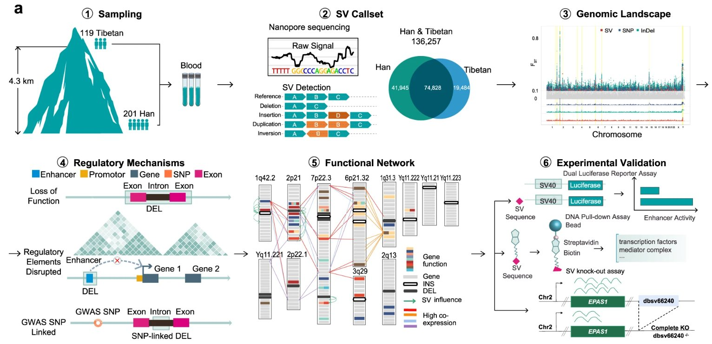
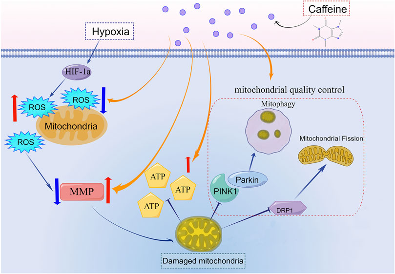
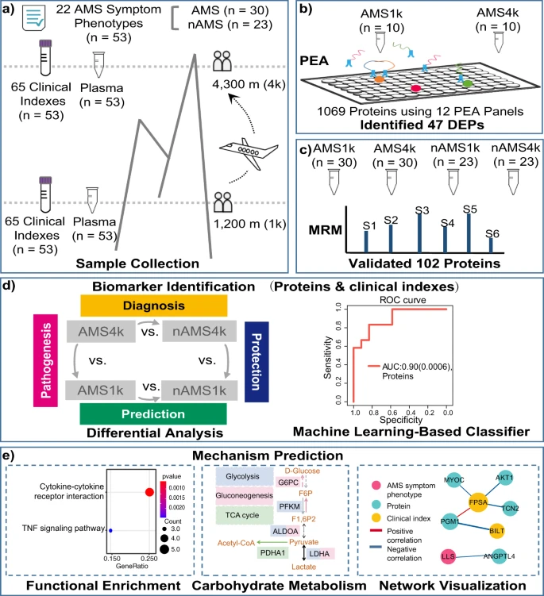
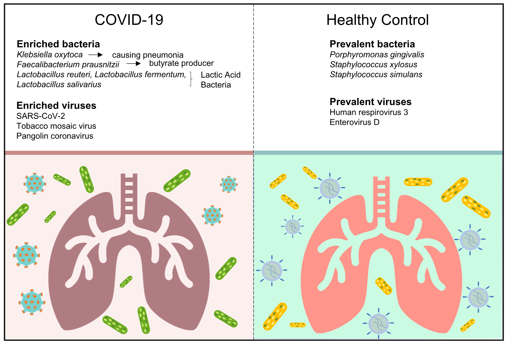
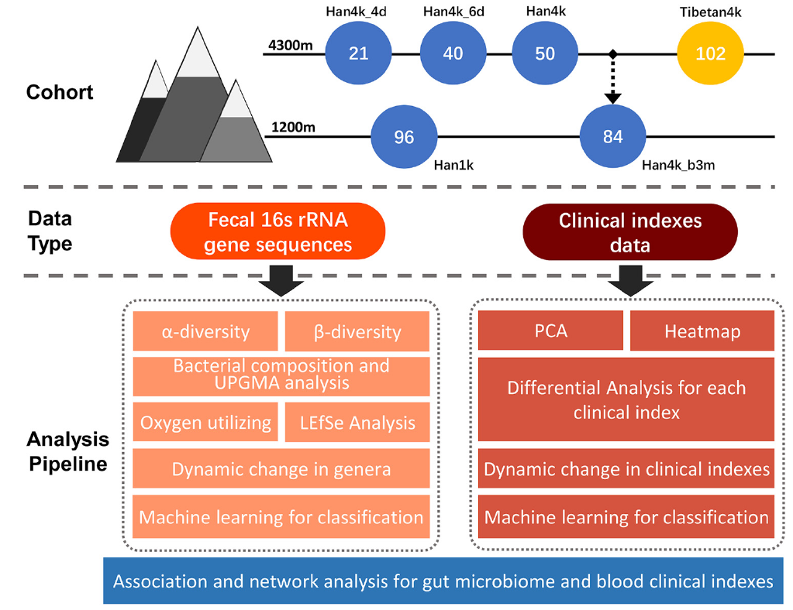
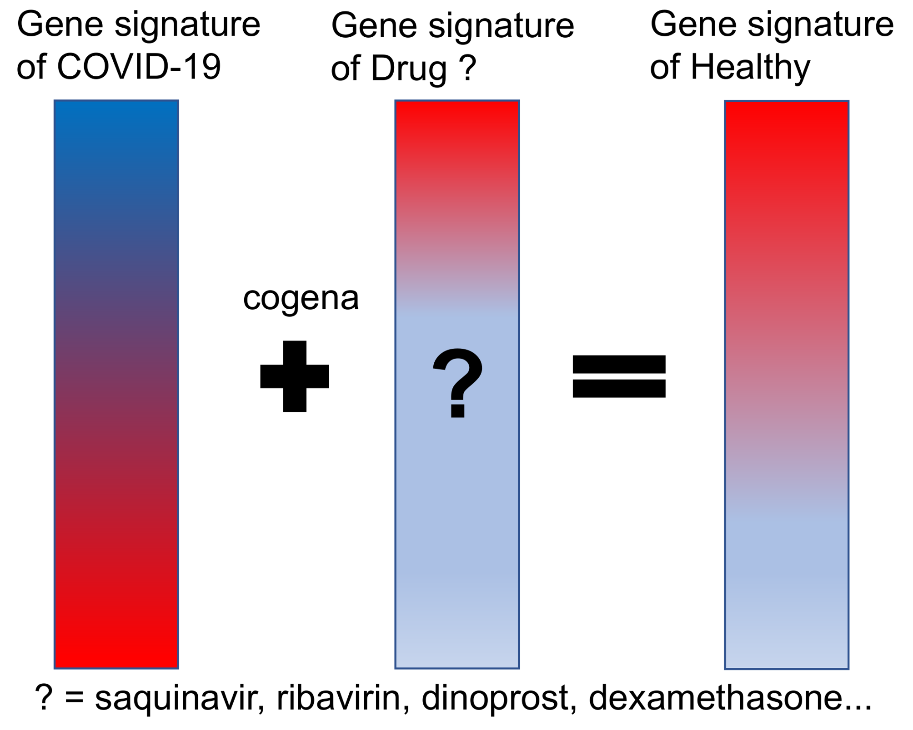
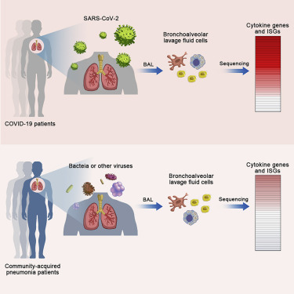
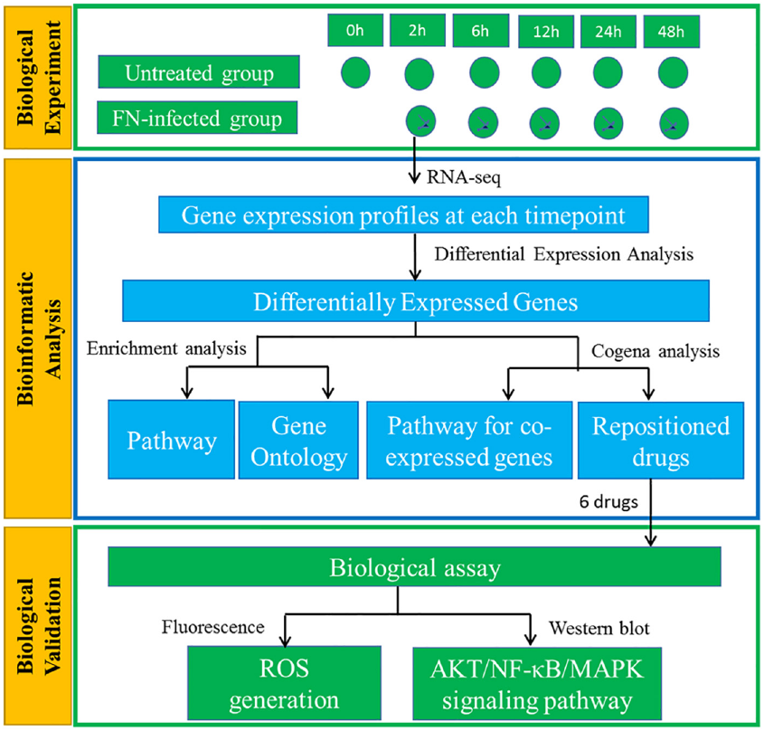
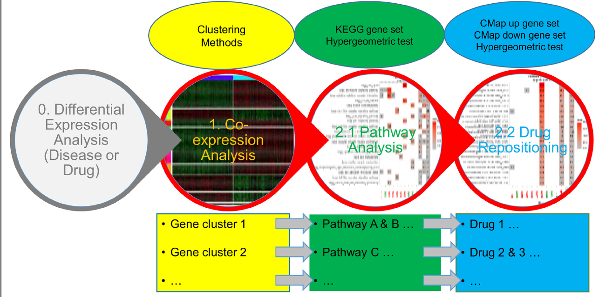
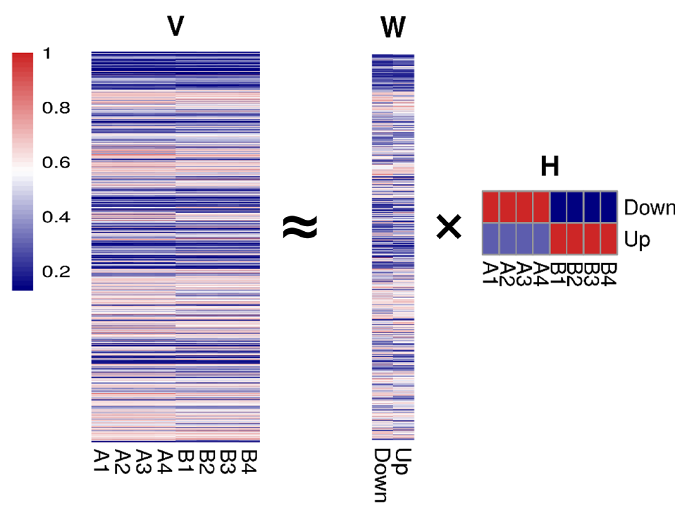

I am an Associate Professor in Chinese PLA General Hospital after obtaining a doctor of philosophy degree in Biomedical Engineering. My research interests are drug repositioning and Omics. I developed drug repositioning methods, such as cogena, and applied them into various diseases, such as cardiovascular disease, periodontal disease, mountain sickness and COVID-19.

Selected papers:
======

* _2023_ [Structural variants involved in high-altitude adaptation detected using single-molecule long-read sequencing](https://www.nature.com/articles/s41467-023-44034-z)
   * [TibetanSV web server](https://zhilong.shinyapps.io/tibetan)
   + 
   
* _2023_ [Low-dose of caffeine alleviates high altitude pulmonary edema via regulating mitochondrial quality control process in AT1 cells](https://www.frontiersin.org/articles/10.3389/fphar.2023.1155414/full)
   + 

* _2022_ [Proteomic and clinical biomarkers for acute mountain sickness in a longitudinal cohort](https://www.nature.com/articles/s42003-022-03514-6)
   + **Reproducible research**: [code](https://github.com/Monica1227/AMS_biomarker)
   + 

* _2021_ [The active lung microbiota landscape of COVID-19 patients through the metatranscriptome data analysis](https://bi.tbzmed.ac.ir/Inpress/bi-23378)
   + **Reproducible research**: [code](https://github.com/yang-han-GH/COVID_Microbiota)
   + 

* _2020_ [Impacts of the Plateau Environment on the Gut Microbiota and Blood Clinical Indexes in Han and Tibetan Individuals](https://journals.asm.org/doi/full/10.1128/mSystems.00660-19)
   + 

* _2020_ [Transcriptome-based drug repositioning for coronavirus disease 2019 (COVID-19)](https://academic.oup.com/femspd/article/78/4/ftaa036/5871823)
   + **Reproducible research**: [code](https://github.com/zhilongjia/COVID-19)
   + 

* _2020_ [Heightened Innate Immune Responses in the Respiratory Tract of COVID-19 Patients](https://www.sciencedirect.com/science/article/pii/S1931312820302444?via%3Dihub)
   + **Reproducible research (only related to my contributions)**: [code](https://github.com/zhilongjia/nCoV2019)
   + 

* _2019_ [Time-Course Transcriptome Analysis for Drug Repositioning in *Fusobacterium nucleatum*-Infected Human Gingival Fibroblasts](https://www.frontiersin.org/articles/10.3389/fcell.2019.00204/full) or [PubMed](http://www.ncbi.nlm.nih.gov/pmc/articles/pmc6771468/)
    + **Reproducible research**: [code](https://github.com/zhilongjia/Fn_HGFcell)
    + 

* _2019_ [Transcriptional profiling in the livers of rats after hypobaric hypoxia exposure.](https://peerj.com/articles/6499/)
    + **Reproducible research**: [code](https://github.com/zhilongjia/AMS_gut_liver_rat)

* _2016_ [Cogena, a novel tool for co-expressed gene-set enrichment analysis, applied to drug repositioning and drug mode of action discovery](http://bmcgenomics.biomedcentral.com/articles/10.1186/s12864-016-2737-8)
    + **cogena**: [code](https://github.com/zhilongjia/cogena) or [Bioconductor](http://www.bioconductor.org/packages/devel/bioc/html/cogena.html)
    + **Reproducible research**: [code](https://github.com/zhilongjia/psoriasis)
    + 

*  _2015_ [Gene Ranking of RNA-Seq Data via Discriminant Non-Negative Matrix Factorization (DNMF)](http://journals.plos.org/plosone/article?id=10.1371/journal.pone.0137782)
    + **DNMF package**: [CRAN](https://cran.r-project.org/web/packages/DNMF/index.html)
    + **Reproducible research**: [code](https://github.com/zhilongjia/geneRanking)
    + 

Meeting with slides:
======
* [Drug repositioning based on coexpressed gene-set enrichment analysis (cogena)](https://github.com/zhilongjia/slides/blob/master/eurobioc2015_FlashlightII_cogena_ZhilongJia.pdf) at [European Bioconductor Developers' Conference 2015](https://sites.google.com/site/eurobioc2015/)

* [Co-expressed gene-set enrichment analysis for drug repositioning with examples of psoriasis and periodontal diseases](https://github.com/zhilongjia/slides/blob/master/ZhilongJia-BDF20191013-v7.pdf) at [The 4th Big Data Forum for Life and Health Sciences 2019](https://bigd.big.ac.cn/conference/bdf2019)

* [Transcriptome-based drug repositioning for COVID-19](https://github.com/zhilongjia/slides/blob/master/BioST20210825_ZhilongJia-v6.pdf) at [World biological science and technology conference 2021 BioST virtual 2021](https://www.biostvirtual.org/)

Updated Date： 18 Dec., 2023.
