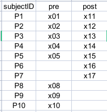

# Summary of Tests for partially paired data

Tests for comparing means of unpaired and paired samples in a cohort. 

## Keywords 
Partially Overlapping Samples, partially paired data, partially correlated data, paired data with missing values, Incomplete Paired Data, paired samples in the presence of missing data, mixed paired and two-sample designs, Two Samples That Include Both Paired and Independent Observations.

## R package
* R package [`IncomPair`](https://cran.r-project.org/package=IncomPair): Comparison of Means for the Incomplete Paired Data
* R package [`Partiallyoverlapping`](https://cran.r-project.org/package=Partiallyoverlapping): Partially Overlapping Samples Tests
* R package [`robustrank`](https://cran.rstudio.com/web/packages/robustrank/index.html): Robust Rank-Based Tests

## Functions
* Rank Based Tests for Incomplete Paired Data
	* `ncomPair::rankb` :  The rank-based methods combine Wilcoxon signed-rank statistics and Wilcoxon-Mann-Whitney two-sample procedures. These methods were developed by Dubnicka, Blair and Hettmansperger (2002).
	*  `robustrank::pm.wilcox.test` Performs rank-based two sample test for partially matched two sample data by combining information from matched and unmatched data. Ref: Youyi Fong, Ying Huang, Maria P Lemos, M Juliana Mcelrath, Rank-based two-sample tests for paired data with missing values, Biostatistics, Volume 19, Issue 3, July 2018, Pages 281–294, [https://doi.org/10.1093/biostatistics/kxx039](https://doi.org/10.1093/biostatistics/kxx039)
* Parametric Based Tests for Incomplete Paired Data
	* `ncomPair::parmb` The function uses six test statistics that were proposed for testing the equality of the means of a bivariate normal distribution with unknown common variance and correlation coefficient when observations are missing on both variates. These function includes Lin and Stivers (1974, Ts), Bhoj (1989, pp. 282, Z), Bhoj (1989, pp. 282, Zb), Bhoj (1989, pp. 283, T), Bhoj (1989, pp. 283, Zh) and Bhoj (1989, pp 284, Zls). For more details, information of the functions see Bhoj (1989).
	* `Partiallyoverlapping::Partover.test` Performs a comparison of means using the partially overlapping t-test, for two samples each with paired and unpaired observations. Ref: Derrick, B., Russ, B., Toher, D., & White, P. (2017). Test statistics for the comparison of means for two samples that include both paired and independent observations. Journal of Modern Applied Statistical Methods, 16(1), 137-157. doi: 10.22237/jmasm/1493597280 .
	* `t.test.partial` Optimal pooled t-test with optimal weights. code aviliable at  [https://gist.github.com/AkselA/9dff13ef662f64188f708c22e0d455ad](https://gist.github.com/AkselA/9dff13ef662f64188f708c22e0d455ad) Ref: Guo B, Yuan Y. A comparative review of methods for comparing means using partially paired data. Stat Methods Med Res. 2017 Jun;26(3):1323-1340. doi: 10.1177/0962280215577111. Epub 2015 Apr 1. PMID: 25834090.
* Permutation Based Tests for Incomplete Paired Data
	* `ncomPair::permb` The function implements two different nonparametric tests based on permutation tests that were proposed by Einsporn and Habtzghi (2013), and Maritz (1995).
	* `robustrank::mw.mw.2.perm` Use permutation-based reference distribution to obtain p values for a test that combines WMW (Wilcoxon-Mann-Whitney) for paired data and WMW for unpaired data. 
* Two dichotomous samples each with paired and unpaired observations
	* `Partiallyoverlapping::Prop.test` Performs a comparison of proportions using the partially overlapping z-test. 

## Types of Missing Data

* **Missing completely at random (MCAR)**: When data are MCAR, the fact that the data are missing is independent of the observed and unobserved data. no systematic differences exist between participants with missing data and those with complete data.
* **Missing at random (MAR)**: When data are MAR, the fact that the data are missing is systematically related to the observed but not the unobserved data. a registry examining depression may encounter data that are MAR if male participants are less likely to complete a survey about depression severity than female participants.
* **Missing not at random (MNAR)**: When data are MNAR, the fact that the data are missing is systematically related to the unobserved data, that is, the missingness is related to events or factors which are not measured by the researcher.

Ref: [Types of Missing Data - Managing Missing Data in Patient Registries - NCBI Bookshelf](https://www.ncbi.nlm.nih.gov/books/NBK493614/)

