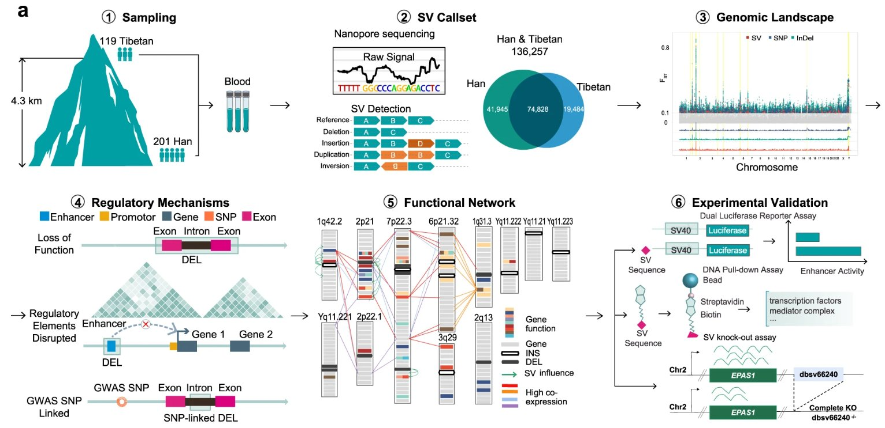

<a href='http://zhilongjia.github.io/files/2023-ONT_tibetan.pdf'>Download paper here</a>

Structural variants (SVs), accounting for a larger fraction of the genome than SNPs/InDels, are an important pool of genetic variation, enabling environmental adaptations. Here, we perform long-read sequencing data of 320 Tibetan and Han samples and show that SVs are highly involved in high-altitude adaptation. We expand the landscape of global SVs, apply robust models of selection and population differentiation combining SVs, SNPs and InDels, and use epigenomic analyses to predict enhancers, target genes and biological functions. We reveal diverse Tibetan-specific SVs affecting the regulatory circuitry of biological functions, including the hypoxia response, energy metabolism and pulmonary function. We find a Tibetan-specific deletion disrupts a super-enhancer and downregulates EPAS1 using enhancer reporter, cellular knock-out and DNA pull-down assays. Our study expands the global SV landscape, reveals the role of gene-regulatory circuitry rewiring in human adaptation, and illustrates the diverse functional roles of SVs in human biology.

Recommended citation: Shi, J., Jia, Z., Sun, J. et al. Structural variants involved in high-altitude adaptation detected using single-molecule long-read sequencing. Nat Commun 14, 8282 (2023). https://doi.org/10.1038/s41467-023-44034-z.