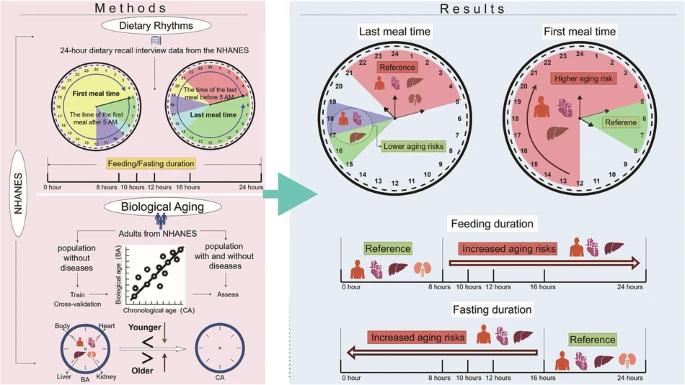

<a href='http://zhilongjia.github.io/files/2026-dietary_aging.pdf'>Download paper here</a>

The effects of dietary rhythms on organ-specific biological aging remain unclear. This study analyzed 14,012 adults from NHANES to assess associations between dietary rhythms and biological aging of the body, heart, liver, and kidneys. Earlier last meals, specifically before 9 p.m., were linked to lower aging risks for the body, heart, and liver but not kidneys. The strongest protective effects were seen with meals between 3 and 5 p.m. for the body and heart, and 5–7 p.m. for the liver. Conversely, later first meals and longer feeding durations (>8 h) linked to higher aging risks. These associations were modified by age, gender, disease status, caloric intake and dietary quality, with effects more pronounced in individuals over 40, males, and those without existing diseases or with low calorie intake. Delayed first and earlier last meal remained significantly associated with body and liver aging in the healthy diet group, whereas heart aging showed stronger associations with meal time in the unhealthy diet group. This study revealed optimal meal timing and duration differ for biological aging across different organs, ages, genders, disease status, energy intake, and dietary quality, highlighting a critical food-nutrient-timing synergy, and the need for personalized nutritional guidance and population-specific dietary strategies.

Recommended citation: Zheng, L., Jia, Z., Gong, S. et al. Dietary rhythms and biological aging risk across multiple organs. npj Sci Food 10, 148 (2026). https://doi.org/10.1038/s41538-026-00799-3
